# **SSR React: Using React Router with DataLoaders**

Nathan Huff

---

---

## Demo

--

## Demo (0.00s)

--

## Demo (0.10s)

--

## Demo (1.15s)
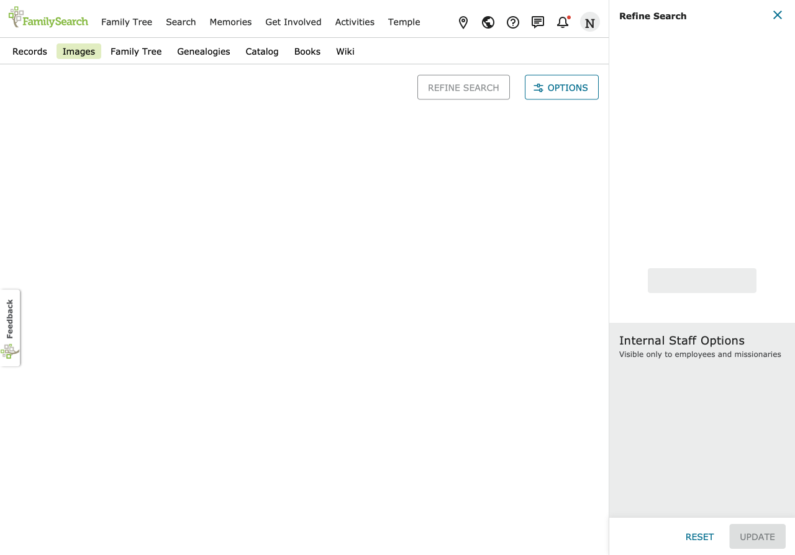

--

## Demo (1.43s)
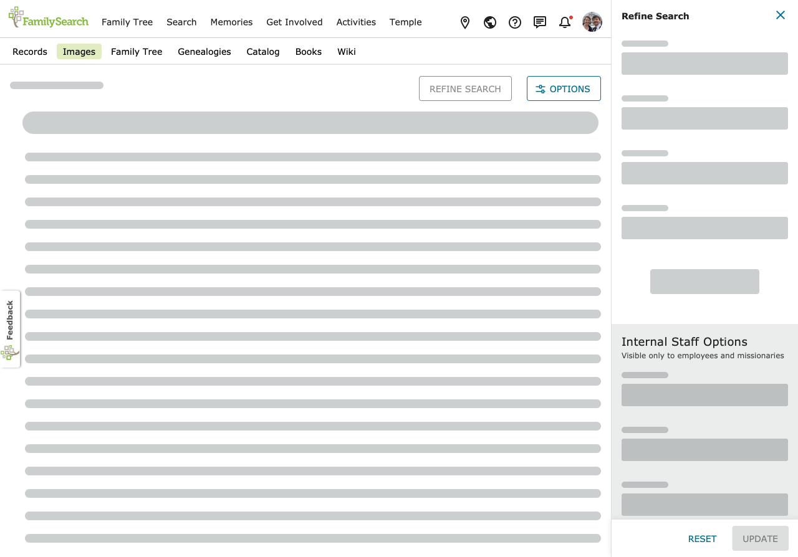

--

## Demo (1.79s)
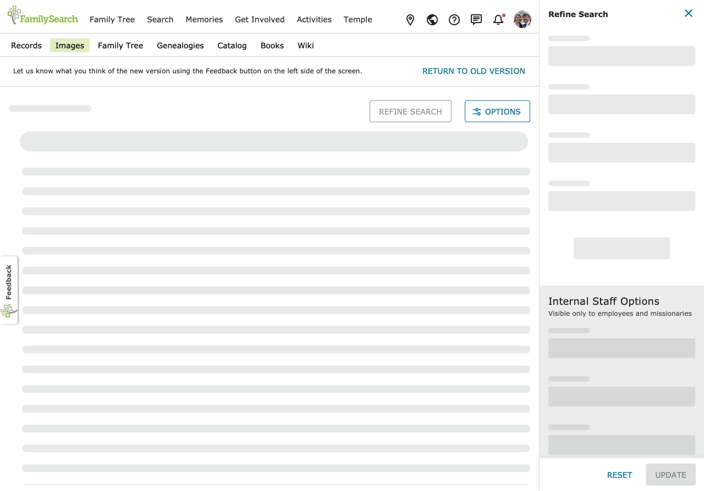

--

## Demo (3.47s)
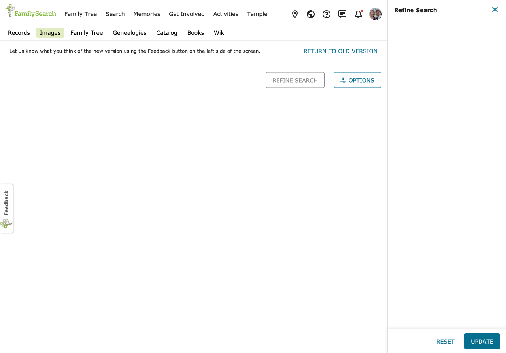

--

## Demo (4.07s)
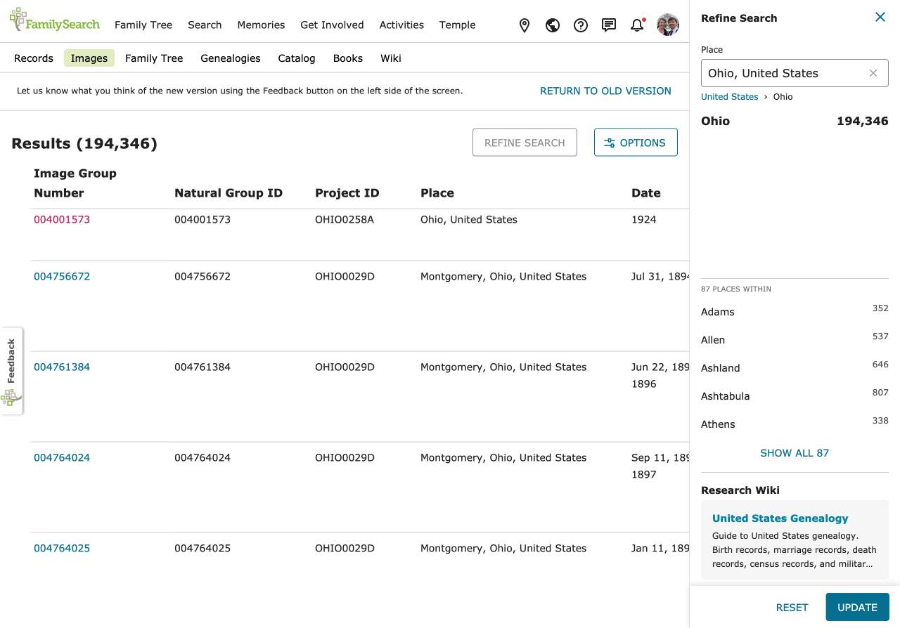

--

## Demo (4.89s)
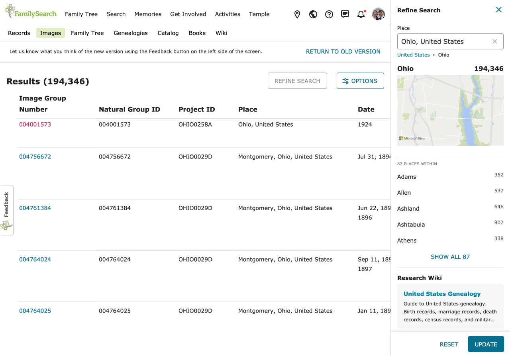

---

## Selling Points(?)
|SSR|CSR|
|--|--|
|SEO Friendly|Visually Responsive|
|Smaller Payload|Longer Initial Load |
|Javascript(?)|Javascript(!)|
|Server Load|Interactive Content|
|Staying Hydrated| |

---

## Bridging the gap with loaders

- ReactRouter v6 added data-loaders
- Runs in parallel when routes are requested
- Hooks can pull in data and state

---

## Remix

- Opinionated React framework
- Use nested routes to control data on page
- React Router rebuilt from Remix ideologies

--

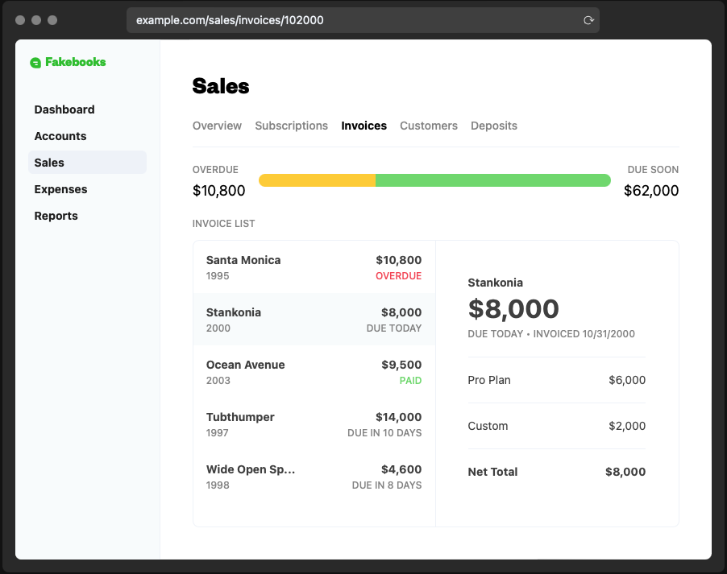

--

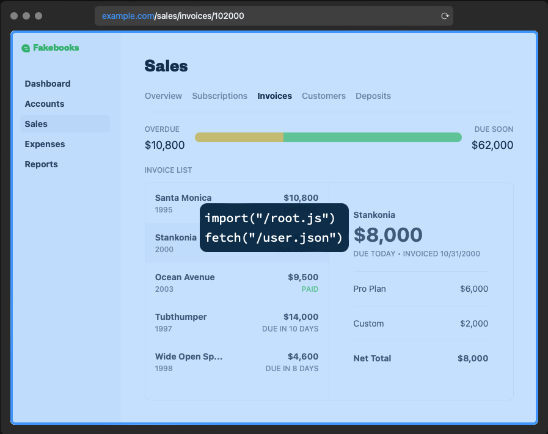

--

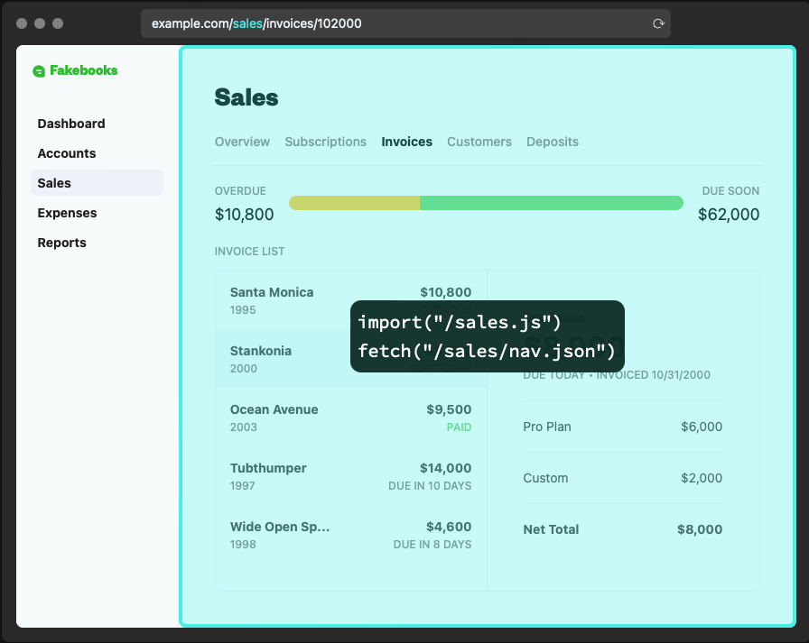

--

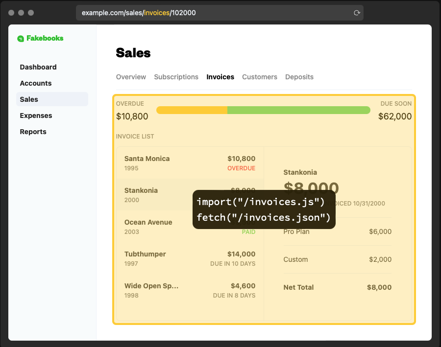

--

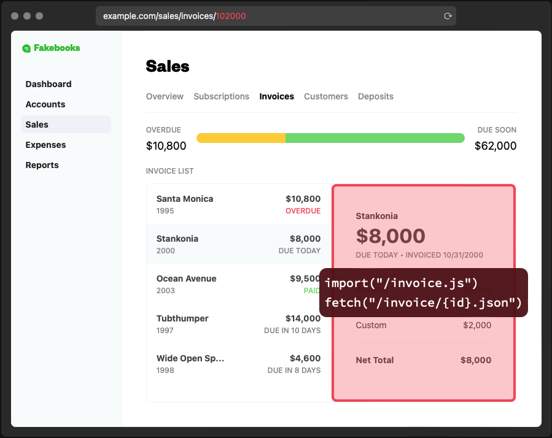

---

## Demo

---

## fin

huffn<!--what@-->@church<!--a@fun-->of<!--presentation@just-->jesuschrist<!--h@ppened-->.org